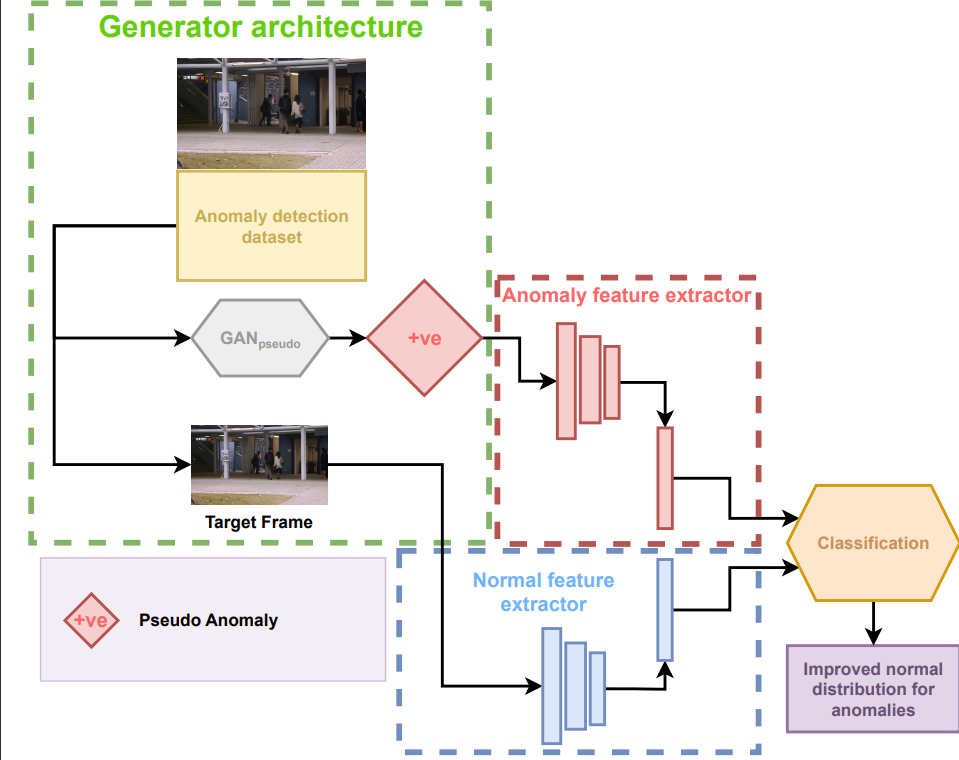
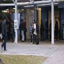
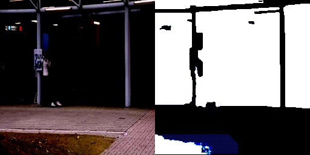
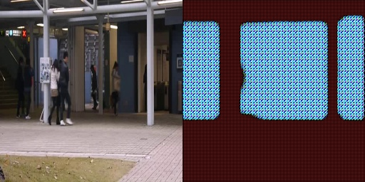
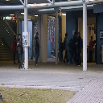
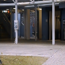
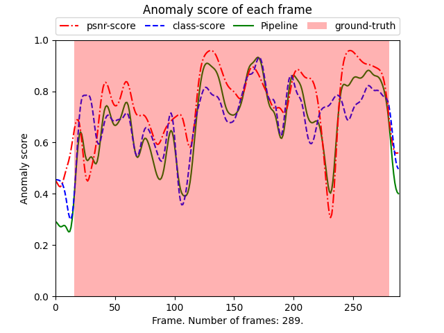
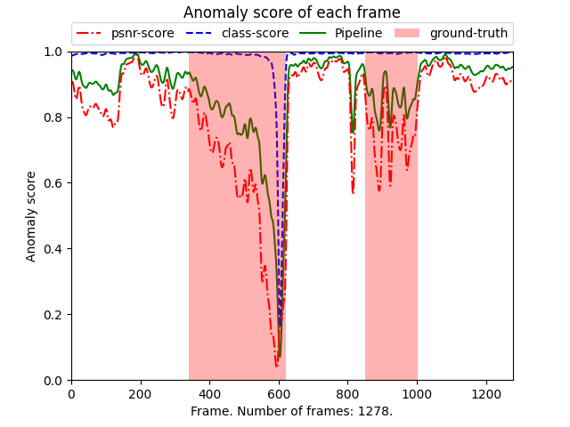
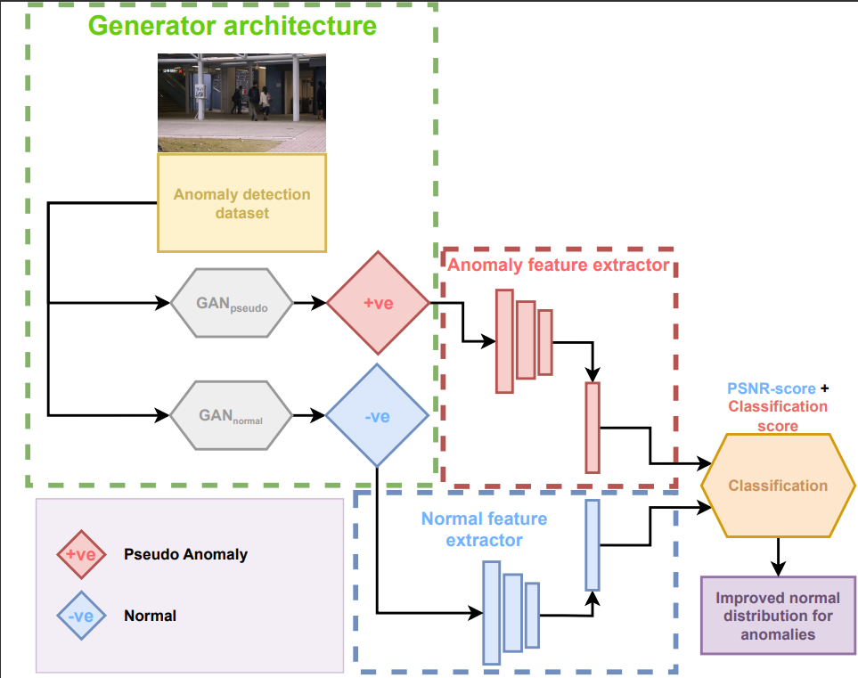

# VGIS10_GAN
Repository for 10th semester master thesis at Vision Graphics and Interactive Systems (VGIS) on Aalborg University.
The project is titled "Pseudo-anomaly generation for improving the unsupervised anomaly detection task - Implementation of a generative neural network."
The project was written from February 2023 to June 2nd 2023.

## Pipeline


The pipeline contains three modules:
1. Generator architecture
2. Anomaly feature extraction
3. Normal feature extraction

### Generator architecture
The generator architecture generates the pseudo-anomalies used to train the anomaly feature extractor. 
For this purpose, a GAN architecture will be used, due to their generative abilities. The overall goal of the GAN architecture is to play a mini-max game between the generator and the discriminator to optimize an objective function, to generate the pseudo-anomalies. 
The GAN architecture is trained on the normal training data of an anomaly detection dataset. 
Changes to the objective function have been made, such that it does not perfectly reconstruct the normal training data. 
This change is necessary such that the pseudo-anomalies are different from the normal frames. Once a pseudo-anomaly is generated it is used in the anomaly feature extractor.

### Anomaly feature extraction
The anomaly feature extractor is responsible for extracting the features which make up the pseudo-anomalies. 
In this part of the proposed system, a discriminator is used. 
During the training of the anomaly feature extractor, fake anomaly labels are used to train the discriminator. 
This feature extraction happens in parallel to training the classifier network.

### Normal feature extraction
During the training of the GAN architecture, a target frame from the data is used.
This feature extractor extracts the features which make up the normal frames. 
Like in the anomaly feature extractor, fake normal labels are used to train the discriminator. 
A discriminator is used for this task, which is trained to classify normal frames. 
This feature extraction happens in parallel to training the classifier network.

## Folders in this repository:
[Anomaly_Prediction_FF](./Anomaly_Prediction_FF/) contains the files needed to run the pipeline for anomaly detection using pseudo-anomalies.

[AnomalyDetection](./AnomalyDetection/) contains the files for the preliminary pseudo-anomaly creation using GANs and the  [MNADrc](https://github.com/alchemi5t/MNADrc) method.

[OGNet](./OGNet/) contains the files for the [OGNet](https://github.com/xaggi/OGNet) model and the training and testing of the model.

## Install procedure:
Made on WSL2 installed with conda.

Clone this repo into your prefered folder:

```bash
https://github.com/TheCanMoun10/VGIS10_GAN
```

Install the required dependencies use the environment.yml file available:

```bash
conda env create -f environment.yml
```

This command creates a conda environment named VGIS10_GAN.

## Dependencies
The environment.yml file install the following dependencies in a conda environment:
* Python 3.8
* PyTorch 1.31.1
* Cuda 11.7
* cuda-toolkit 11.3
* Numpy
* Sklearn
* OpenCV
* Matplotlib
* Wandb
* tensorboardX
* Pillow

## Anomaly Pipeline training:
Make sure to cd into the Anomaly_Prediction_FF folder:

```bash
cd Anomaly_Prediction_FF
```

Before training make sure to create the necessary folders:

```bash
mkdir dataset
mkdir models
mkdir weights
```

Follow the instructions in the [README file](https://github.com/feiyuhuahuo/Anomaly_Prediction/blob/master/README.md) in the Anomaly_Prediction_FF folder on how to set up training and testing.

Once setup is done, training can be done by running:

```bash
python train.py --batch_size 16 --dataset avenue --iters 1000 --save_interval 1000 --wfl_loss 0.6
```

The above command will save a model in the weights folder: ``weights/fullnetwork_avenue_10001_flloss0.6_perceptloss_classifier.pth``

Generator images are saved in an images folder inside a folder named after the specified dataset.

To evaluate the model run:

```bash
python evaluate.py --dataset=avenue --trained_model=fullnetwork_avenue_10001_flloss0.6_perceptloss_classifier.pth
```

Evaluation during training can also be done by running:

```bash
python train.py --batch_size 16 --dataset avenue --iters 1000 --save_interval 1000 --wfl_loss 0.6 --val_interval 500
```
This will make the model evaluate every 500 iterations and save the results in the created evals folder.

### Pseudo-anomaly generated:
Target frame:
 

Generated pseudo-anomaly:


## Training of AnomalyDetection:
Make sure to cd into the AnomalyDetection folder:

```bash
cd AnomalyDetection
```

Follow the instructions in the [DATASETS file](./AnomalyDetection/datasets/DATASETS.md) in the AnomalyDetection folder on how to set up the dataset folder.

### Training of convAE
This training is only to see if a convAE without adversarial training can be used to create pseudo-anomalies.

Once setup is done, training with KL loss can be done by running:

```bash
python Train_recons_wo_mem.py --lr 0.00002 --epochs 15 --batch_size 8 --t_length 2 --dataset_type avenue --loss KL --h 128 --w 128 --img_norm mnad_norm --test_number 1 --nega_loss --nega_value 0.1 --wandb
```
To evaluate the model run:

```bash
Evaluate_recons_wo_mem.py --t_length 2 --alpha 0.7 --th 0.015 --test_batch_size 2 --dataset_type avenue --model_dir ./exp/avenue/Test1--lossKL-NegaLoss0.1/14_negLossTrue_model.pth --img_norm dyn_norm --h 128 --w 128
```
Two normalisations can be used for the evaluation: mnad_norm and dyn_norm. 
mnad_norm normalizes the images to [-1, 1] range, while dyn_norm normalizes the images to [0, 1] range.
#### Psuedo-anomaly created:
 




### Training of GAN:
This training is to see if a GAN can create the normal images from the Avenue dataset.

Once setup is done, training can be done by running:

```bash
python gannetwork.py --lr 0.0002 --epochs 16 --batch_size 16 --t_length 2 --dataset_type avenue --loss MSE --h 128 --w 128 --img_norm mnad_norm --test_number 6 --type DCGan --wandb
```
No evaluation is done for this training, as it is only to test if the GAN can recreate the normal images.

#### Reconstruction of normal images:
Real image:


Reconstruction:


## OGNet Training and testing:
Make sure to cd into the OGNet folder:

```bash
cd OGNet
```
Before training make sure to create the necessary folders:

```bash
mkdir models
mkdir results
```

```bash
python train.py --data_path ./data/avenue_full/training --nc 3 --normal_class frames --epoch 26 --batch_size 32 --n_threads 0 --image_grids_numbers 30 --wandb
```

## Datasets.
* CUHK Avenue [dataset](https://github.com/StevenLiuWen/ano_pred_cvpr2018)

These datasets are from an official github of "Future Frame Prediction for Anomaly Detection - A New Baseline (CVPR 2018)".

### Anomaly Prediction FF:
Download the datasets into [dataset](./Anomaly_Prediction_FF/dataset/) folder, like ``./dataset/avenue/``

### Anomaly Detection:
Download the datasets into [datasets](./AnomalyDetection/datasets/) folder, like ``./datasets/avenue/``

### OGNet:
Download the training images of the Avenue dataset into [data](./OGNet/data/) folder, like ``./data/training/``

Download the testing images of the Avenue dataset into [data](./OGNet/data/) folder, like ``./data/testing/``
* The testing folder should be divided into two subfolders ``frames`` and ``frames2``

### Other datasets that can be used (not yet implemented):
* ShanghaiTech [dataset](https://github.com/StevenLiuWen/ano_pred_cvpr2018)
* USCD Ped2 [dataset](https://github.com/StevenLiuWen/ano_pred_cvpr2018)


## Results:
The results are worse than the baseline, however that is to be expected as the pseudo-anomaly generator is evalauted.
### Quantitative results:
The overal pipeline result is shown below, compared to other SOTA methods, including the baseline for predicting anomalies [Future Frame](https://github.com/StevenLiuWen/ano_pred_cvpr2018).

Highest achieving AUC score is shown in bold and italics, second highest is shown in bold.
|                         | AUC         |
|-------------------------|-------------|
| Giorno et al.           |    78.3%    |
| Conv-AE                 |     80%     |
| ConvLSTM-AE             |     77%     |
| DeepAppearance          |    84.6%    |
| Unmasking               |    80.6%    |
| Stacked RNN             |  **81.7%**  |
| Future Frame (Baseline) | **_85.1%_** |
| P_abnormal              |    68.35%   |
| P_normal                |    72.42%   |

### Qualitative results:
An example of the qualitative results of the pipeline on the Avenue dataset is shown below, comparing psnr score with added classification score.

The plots below shows how well the pipeline classifies frames as normal and abnormal.
#### Good example:


#### Bad example:


### Further improvements:
Adding a second branch to the pipeline to generate predicted normal frames:


## Future improvements:
- [ ] Add second branch to pipeline to generate predicted normal frames.
- [ ] Implement the other datasets.
